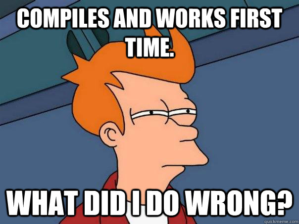
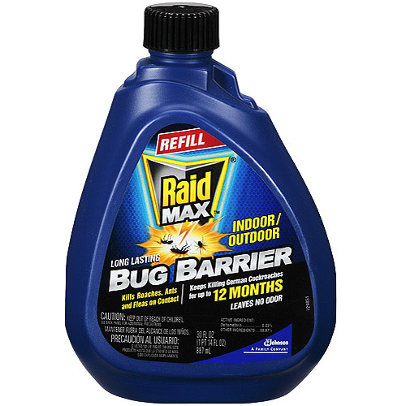
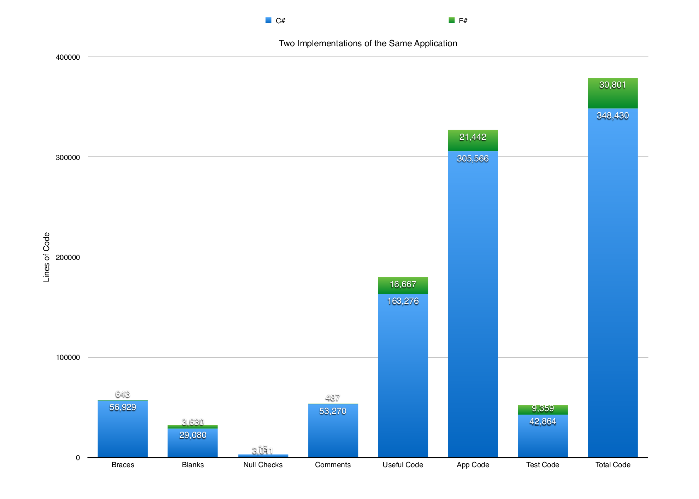

.. role:: cover

============================================
:cover:`Functional programming`
============================================

.. class:: cover

    ::

        Jonas Juselius <jonas.juselius@uit.no>
        HPC@UiT

.. raw:: pdf

   SetPageCounter 0
   Transition Dissolve 1
   PageBreak oneColumn

What is Functional Programming
----------------------------------------------------
* Invented in the 30ies (Alonzo Church)
* Not popularized due to limited computers
* Functions are *first class*
    * Data and functions are equivalent
    * Lambda functions
    * Higher-order functions
    * Function composition
    * Partial function application

* Functions are pure
* Immutable data: no state, no variables
* Advanced type systems

Languages
---------------------------------------------------
* Haskell: Pure functional, immutable, lazy, advanced types
* Scala: Functional, object oriented running on JVM
* Clojure: Modern, concurrent LISP on top of JVM
* F#: Functional, object oriented on top of CLR
* Python: lambda, HOFs, map, zip, filter, reduce
* JavaScript can emulate functional programming with HOFs

Haskell
---------------------------------------------------
* Purely functional language
* Strongly typed (and no ma, you ain't seen strong)
* Lazy by default
* Elegant syntax
* Efficient
* "If it compiles, it works!" (often)

Function composition
---------------------------------------------------

* Composition is *the* way to reduce complexity

.. code:: python

    print(sin(float('2')))
    a = f(g(h(x)))

.. code:: sh

    $ cat file.txt | sort
    $ cat file.txt | rev | head -2
    $ cat file.txt | tr a-z A-Z | sed 's/$/!!!/'

.. code:: haskell

    a x = take 2 . rev . sort $ x
    a' = take 2 . rev . sort

* This is why we don't use parens in Haskell

Purity
---------------------------------------------------
* Pure functions has no notion of state: They take input values and return
  values
* Given the same input, a pure function *always* returns the same value!
  Function calls can be optimized away!
* Pure function == data!
* Purity is key to equational reasoning

Currying
---------------------------------------------------
* Partial application of functions
* All functions take one or zero arguments and return a function

.. code:: haskell

    add :: Int -> Int -> Int
    add x y = x + y

    add42 :: Int -> Int
    add42 = add 42

    mulf2 :: (Int -> Int) -> Int -> Int
    mulf2 f x = 2 * f x

    main = do
        print $ mulf2 (add 42) 5
        print $ mulf2 add42 5

Looping
---------------------------------------------------
* No state -> no loops: Recursion  and tail recursion
* Loops are hard to understand (but recursion is worse)
* Loops are not declarative
* map, filter and fold: Looping with style!

Concurrency
---------------------------------------------------
Concurrency is nearly trivial

.. code:: haskell
    :include: code/parray.hs

Real life
---------------------------------------------------

Summary of advantages
----------------------------------------------------
* Reduced complexity
* Easier to reason about code
* Easier testing
* Easier parallelism and concurrency
* Higher level abstractions
* Less boiler plate, shorter code

.. image:: img/haskell.png
    :scale: 60%

Fortran example
---------------------------------------------------

.. code-block:: Fortran
    :include: code/fp.f90

What can I do?
---------------------------------------------------
* In fortran, write *pure* and *elemental* functions when possible
* In C++ use shared_ptr and/or smart_ptr
* Write modular code
* Don't write objects when a function will do
* Write short functions which do one thing and do it well
* Avoid global variables, including module and object state
* Keep the IO layer connected and thin
* Don't reuse variables

